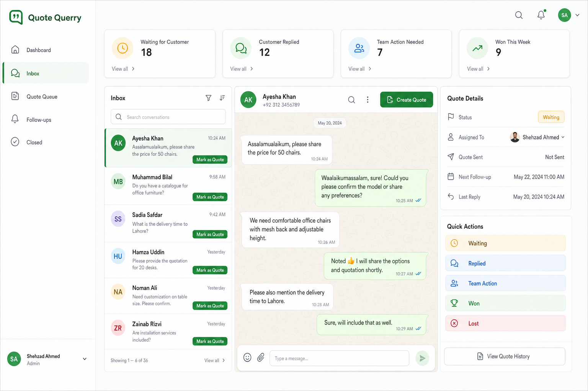

# Quote Recovery Queue - Product System Summary

Last updated: August 2, 2026 (state model revised August 6, 2026 — see [[auto_classification_state_model_2026-08-06]])

## What our product is

Quote Recovery Queue is a simple quote-tracking system for quotation-heavy businesses that mainly work on WhatsApp.

Its job is:

- help businesses remember which quotes were sent
- show which customers replied
- show which quotes are stuck
- show which team member needs to act next
- help move every quote to a clear result

## What our product is not

It is not:

- a generic chatbot
- a full CRM
- a full ERP
- accounting software
- payment software
- a quotation maker
- a WhatsApp clone

## Core idea in one line

Every inbound WhatsApp conversation is tracked automatically from the moment it arrives, starting as unanswered — the business marks it `Quoted` once a price is actually sent.

## Why this changed (Aug 2, 2026)

Original design assumed the only failure was "quote sent, then customer goes quiet" — entry point was a manual `Mark as Quote` click, which requires the owner to already know a quote happened.

That misses a separate, earlier failure: an inbound pricing question that sits unread/ignored and never gets quoted at all. You cannot ask an owner to manually mark something they never noticed — and you cannot ask them to *quantify* messages they never saw ("how many are you missing" is unanswerable by definition).

Fix: don't require a manual action to start tracking. Every inbound message enters the pipeline automatically as `Unanswered`. `Mark as Quote` becomes a stage transition, not the entry point.

## Simple workflow (superseded — see [[auto_classification_state_model_2026-08-06]] for the current model)

1. Customer messages the business on WhatsApp
2. The conversation loads into our system through WhatsApp integration
3. It automatically enters the queue as `Unanswered` — no manual action needed
4. If it sits unanswered past a time threshold (e.g. 24 hours), it surfaces on a "Needs First Reply" dashboard tile
5. When staff actually sends a quotation / estimate / BOQ, they click `Mark as Quote`
6. The system starts tracking what happens after the quote was sent
7. The quote stays tracked until it becomes won, lost, delayed, or otherwise closed

**Aug 6 revision:** step 5's manual click was found to reopen the same "gets buried" failure the product exists to fix — a person who misses a message will equally miss clicking a button about it. Current model: every conversation is auto-classified into a state purely from WhatsApp message ticks (read/delivered) + elapsed time, with zero manual action required anywhere. `Mark as Quote` still exists but only as an optional value/outcome-tracking annotation, not a gate. Full detail in [[auto_classification_state_model_2026-08-06]].

## The most important product rule

On arrival:

- every inbound conversation is `Unanswered` by default, tracked with no manual step

After `Mark as Quote`:

- it becomes a tracked business quote, moving through the normal follow-up states

Not every chat becomes a quote — many stay `Unanswered` or get closed as not-a-lead. But no inbound message silently disappears before someone decides that.

## Explicit non-feature: no keyword/intent detection

Considered and rejected: auto-flagging "buyer intent" messages by matching words like "price" / "rate" / "qeemat".

Rejected because every business uses different words, phrasing, and language mix (Urdu/English/Roman Urdu) — this would require custom setup per client, which doesn't scale and isn't a v1 problem worth solving.

v1 stays purely time-based: unanswered-duration is the only trigger. Simple, universal, works identically for every business with zero configuration.

## Locked UI structure

### Left sidebar

The left sidebar should contain:

- Dashboard
- Inbox
- Quote Queue
- Follow-ups
- Closed

### Dashboard

Dashboard is the bird's-eye view.

It should show stats like:

- Waiting for Customer
- Customer Replied
- Team Action Needed
- Won This Week
- overdue follow-ups

This helps the owner understand what needs attention fast.

### Inbox

Inbox should show WhatsApp-style conversations.

Each row should show:

- customer name or number
- last message preview
- latest activity time
- a small button like `Mark as Quote`

Purpose of Inbox:

- see normal conversations
- open the full conversation
- decide which chat has reached quotation stage

### Center chat area

When a conversation is opened, the center of the screen should show a familiar WhatsApp-style thread.

It should help staff:

- read the full conversation
- understand customer context
- click `Create Quote` when a real estimate has been sent

This is not meant to be a full WhatsApp replacement.
It is meant to give enough conversation context to manage quotes properly.

### Right-side quote panel

The right-side panel should show the quote details and quick actions.

It should contain:

- Status
- Assigned To
- Quote Sent date
- Next Follow-up
- Last Reply

Quick action buttons can include:

- Waiting
- Replied
- Team Action
- Won
- Lost

## Quote Queue meaning

Quote Queue is the core of the product.

It should show only tracked quote-stage conversations, not all chats.

This section should help the owner answer:

- Which quotes are waiting on the customer?
- Which customers replied?
- Which quotes need team action?
- Which quotes are overdue?
- Which quotes were won or lost?

## Main quote statuses

Current practical status set:

- Unanswered (default on arrival, before any quote is sent)
- Waiting for Customer
- Customer Replied
- Team Action Needed
- Needs Revision
- Won
- Lost
- Delayed
- Closed

## Why the product is useful

Businesses often send quotes on WhatsApp and then lose track of what happened next.

Common problems:

- sales staff forget follow-up
- customer replied but team did not notice in time
- quote stays buried in chat history
- owner cannot see which quotations are active or dying

Our product solves this by making the quote visible, trackable, and easy to act on.

## WhatsApp integration direction

This product becomes valuable only if WhatsApp conversations can load into the system.

So the current direction is:

- connect a business WhatsApp setup
- load conversations into an inbox-style interface
- let staff mark quotation-stage chats as quotes
- track activity and status after quote send

Without this, the product becomes too manual and starts feeling like notes or Excel.

## What is already clear enough for outreach

We are now concrete enough to explain the product to businesses as:

`A WhatsApp-based quote recovery system that helps you track sent quotations, see who replied, and stop sales from dying silently.`

## What still needs to be refined later

These can be improved before build, but they do not block outreach:

- exact quote creation form fields
- exact reopen logic
- exact overdue timing rules
- exact dashboard metrics
- exact automation depth for follow-ups

## Current system-design conclusion

The product is now concrete at a business-logic level:

- chats load into Inbox
- staff marks the important ones as quotes
- quotes enter Quote Queue
- Dashboard shows quote status and urgency
- owner can clearly see what needs action next

This is concrete enough to begin outreach and demand validation.
